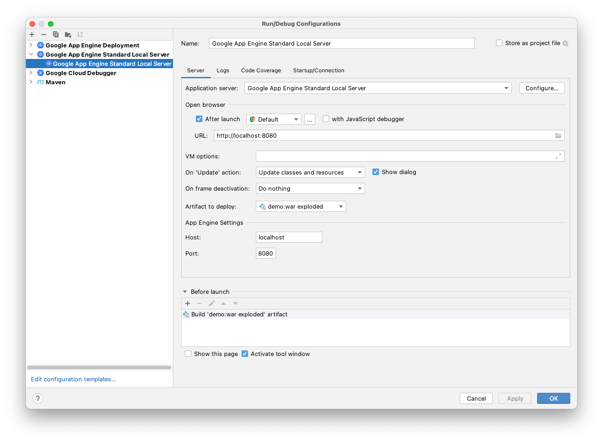

# Running the demo

## 1. Install Google Cloud SDK

### Linux

#### Install the Appengine SDK.

`$ sudo apt-get install google-cloud-sdk-app-engine-java`

### Mac

#### Install the Google Cloud SDK.

`$ brew install google-cloud-sdk`

#### Use GCloud CLI to install the Java Appengine

`$ gcloud components install app-engine-java`

## 2. Add IDE Plugin

### Intellij

Install [Cloud Code Plugin for Intellij](https://plugins.jetbrains.com/plugin/8079-cloud-code)

_If you have worked with the App Engine Plugin before,
please [migrate](https://cloud.google.com/code/docs/intellij/migrate)._

### Eclipse

Install [Cloud Code Plugin for Eclipse](https://marketplace.eclipse.org/content/google-cloud-tools-eclipse)

### Visual Studio Code

Install [Cloud Code Plugin for Visual Studio Code](https://marketplace.visualstudio.com/items?itemName=GoogleCloudTools.cloudcode&ssr=false#overview)

## 3. Run

Most IDEs should autodetect your configuration after installing the plugin (and
restart)

## (Optional) Run Natively

This is _not recommended_ with an IDE as you have to manage updating your
artifacts yourself, it does not support live reload

`$ mvn appengine:run`
